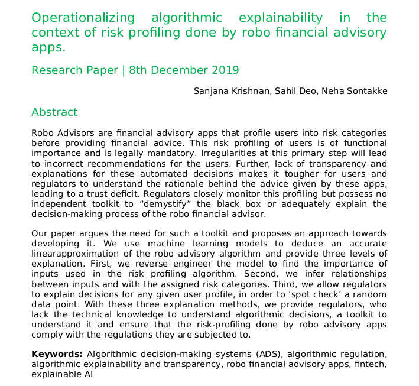

# Operationalizing explanations of the risk profiling algorithm used by robo financial advisory apps.
## Why?
 
There is a growing ubiquity regarding the decision-making algorithms that have started affecting people's lives. Our research is an attempt to operationalize the concept of explainability in automated tools used in fintech. We have selected the case of robo financial advisory apps which conduct a risk profiling of users based on a questionnaire and use it to give them investment advice. These algorithms are subjected to regulations in India and several other countries. However, regulators without the technical knowledge possess no means to understand the algorithms and test it themselves. Our research explores various explainability methods and implements it.
 
The detailed reasoning behind the methodology used is presented in our research paper, an excerpt displayed below.
 

 
## How?
 
Questions were gathered using many robo financial advisory app questionnaires. These questions and their respective answers were assigned scores according to the table given below. Four different equations were used to create different types of datasets, with different relationships. These datasets were then sampled (After chosing an appropriate size using the sampling analysis) to represent data given to a regulator. Reverse engineering the equations and explanations are found from these samples of data. The entire method as well as our thought process behind the study is explained further in the paper.
 

 
Contents of the repository
 
Instructions of use
 
Presented at

